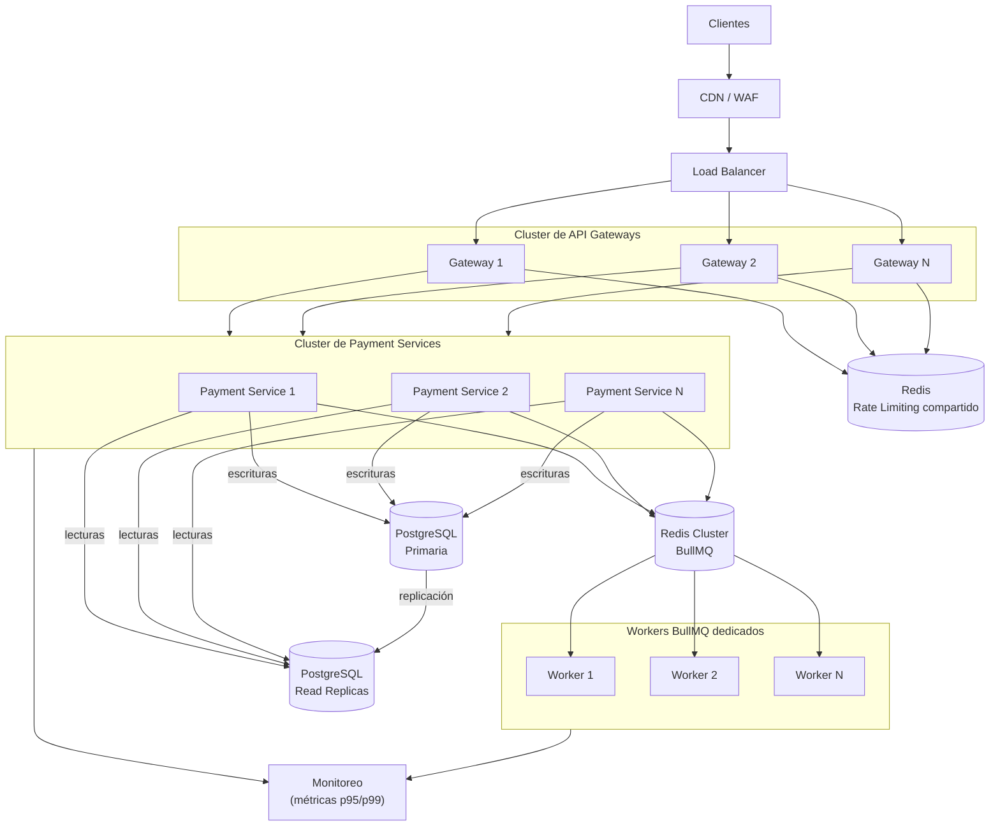
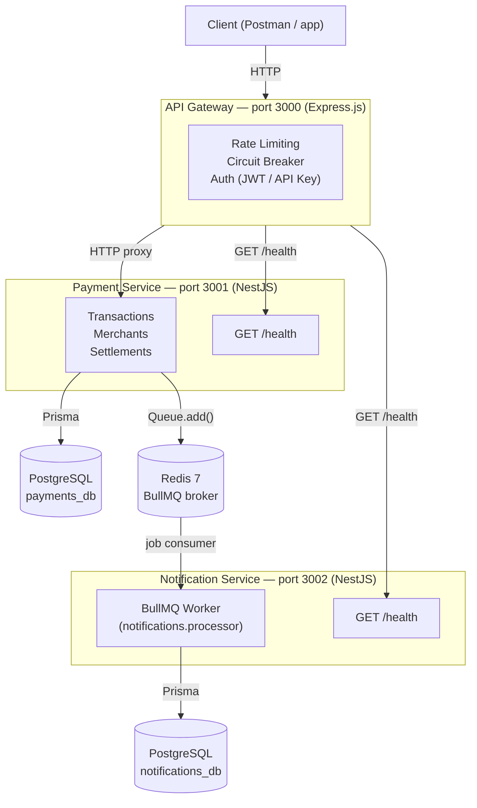
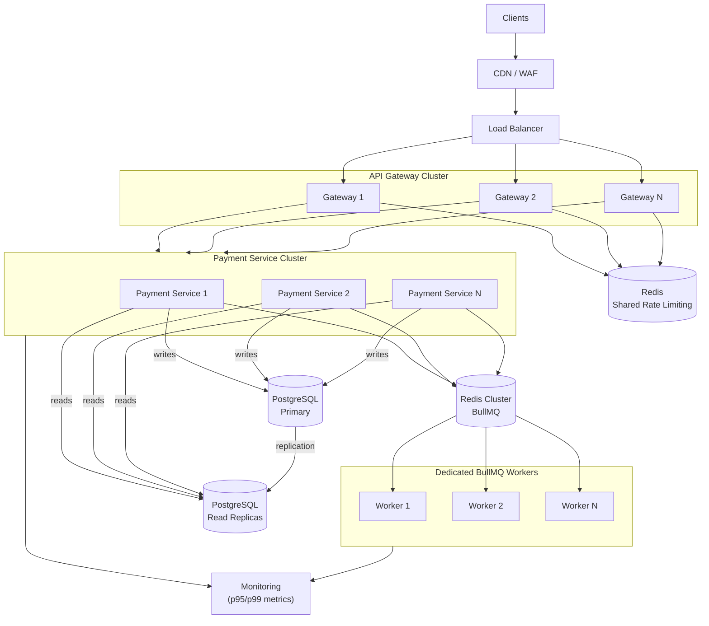

# Arquitectura del sistema / System Architecture

---

## Español

### Diagrama general

---

### Decisiones de diseño

#### BullMQ sobre HTTP asíncrono para notificaciones

La comunicación entre el payment-service y el notification-service es intencionalmente asíncrona y desacoplada. Usar una llamada HTTP directa desde el payment-service al notification-service introduciría acoplamiento temporal: si el notification-service está caído, el payment-service necesitaría reintentar, gestionar timeouts y decidir si fallar la transacción original por un proceso secundario.

Con BullMQ, el payment-service publica un job en Redis al actualizar el estado de una transacción y continúa inmediatamente. El notification-service consume ese job cuando esté disponible. Los jobs persisten en Redis, por lo que si el notification-service se reinicia ningún evento se pierde. BullMQ provee reintentos configurables, dead-letter queues y visibilidad del estado de cada job sin código adicional.

#### PostgreSQL sobre otras bases de datos

Las transacciones financieras requieren propiedades ACID estrictas. Un registro de pago que queda a medias por un fallo de red es un problema de negocio grave; con PostgreSQL las transacciones de base de datos garantizan atomicidad a nivel de fila. El soporte de tipos `DECIMAL(12,2)` evita errores de punto flotante al acumular importes. Los índices parciales y el particionamiento por rango de fechas, relevantes para la propuesta de escalabilidad, son características maduras en PostgreSQL. Adicionalmente, el ecosistema de herramientas de auditoría, backup y replicación es amplio y bien documentado.

#### Express.js para el gateway y NestJS para los servicios

El gateway es un componente de infraestructura cuya responsabilidad principal es enrutar, autenticar y aplicar políticas de tráfico. Express.js es ligero, tiene overhead mínimo por request y su modelo de middlewares encadenados se ajusta naturalmente a ese patrón. Añadir NestJS en el gateway agregaría la carga del contenedor de inyección de dependencias, decoradores y módulos para una capa que no contiene lógica de dominio.

Los servicios de negocio (payment-service, notification-service) sí contienen lógica de dominio compleja, múltiples capas (controllers, services, guards, DTOs, processors) y necesitan inyección de dependencias, validación declarativa y un ciclo de vida de módulos gestionado. NestJS provee esa estructura sin que el equipo tenga que construirla desde cero, lo que reduce la superficie de errores en código de infraestructura.

#### Prisma v7 como ORM

Prisma separa el esquema de la base de datos (schema.prisma) del código de acceso a datos, lo que facilita revisiones de cambios de modelo en pull requests. El cliente generado es completamente tipado en TypeScript: un campo renombrado en el esquema produce un error de compilación en todos los sitios que lo usan, antes de llegar a producción. Las migraciones son archivos SQL explícitos versionados en el repositorio, lo que da trazabilidad completa del historial del esquema. La integración con el driver adapter `@prisma/adapter-pg` permite compartir el pool de conexiones de `pg` entre Prisma y otras partes de la aplicación si fuera necesario.

#### Circuit Breaker en el gateway

Si el payment-service experimenta una degradación severa (latencia alta, conexiones agotadas), sin circuit breaker cada request del cliente esperaría hasta el timeout de axios antes de recibir un error. Bajo carga alta eso agota el pool de conexiones del gateway y puede propagarse como cascada de fallos. El circuit breaker registra los fallos y, al superar el umbral, pasa a estado OPEN y rechaza requests inmediatamente con 503, protegiendo tanto al payment-service como al gateway. El estado HALF_OPEN permite recuperación gradual sin intervención manual.

#### Rate limiting en memoria y no en Redis

Para un único proceso de gateway el almacenamiento en memoria es suficiente, tiene latencia de microsegundos (sin round-trip de red) y no introduce una dependencia operacional adicional. La contrapartida, detallada en la sección de trade-offs, es que no escala horizontalmente. La decisión es apropiada para el entorno actual y la propuesta de escalabilidad contempla la migración a Redis cuando se requieran múltiples instancias del gateway.

---

### Trade-offs

**BullMQ requiere Redis como dependencia adicional**, pero a cambio garantiza la entrega de eventos aunque el notification-service esté caído en el momento en que se actualiza el estado de una transacción. Los jobs persisten en Redis hasta que son procesados con éxito, eliminando la necesidad de lógica de reintento en el payment-service y reduciendo el acoplamiento entre servicios.

**El rate limiting en memoria no escala horizontalmente.** Cada instancia del gateway mantiene contadores independientes. Con dos instancias, un cliente puede enviar el doble de requests antes de ser limitado. En producción con múltiples réplicas del gateway el rate limiting debería centralizarse en Redis usando estructuras de datos como sorted sets o el módulo `redis-cell`, de modo que todas las instancias compartan el mismo estado de contadores.

**La autenticación dual (JWT + API Key) agrega complejidad** al authMiddleware y a las pruebas, ya que hay dos flujos distintos de validación. La ventaja es flexibilidad: los integradores machine-to-machine usan API keys de larga duración sin necesidad de gestionar tokens de corta duración, mientras que los clientes interactivos pueden usar JWT con expiración corta y refresh tokens. La combinación cubre ambos casos de uso sin forzar a ninguno a usar un mecanismo inadecuado.

**El circuit breaker puede rechazar requests válidos durante el estado HALF_OPEN.** Cuando el circuito pasa de OPEN a HALF_OPEN, solo deja pasar una request de prueba; las demás reciben 503 inmediatamente aunque el servicio ya se haya recuperado. Esto introduce un período de recuperación más lento a cambio de proteger al servicio de una avalancha de tráfico acumulado en el momento en que vuelve a estar disponible.

---

### Propuesta de escalabilidad para 10,000 transacciones por segundo

El sistema actual es funcional para cargas de desarrollo y prueba. Para alcanzar 10,000 transacciones por segundo de forma sostenida se requieren cambios en varias capas.

**Múltiples instancias de payment-service detrás de un load balancer.** El payment-service es stateless en lo que respecta a HTTP: toda la persistencia va a PostgreSQL o Redis. Se puede escalar horizontalmente agregando instancias sin coordinación entre ellas. El load balancer distribuye el tráfico y elimina el único punto de fallo.

**Rate limiting con Redis compartido entre instancias del gateway.** Con un cluster de gateways cada instancia debe leer y escribir los contadores de rate limiting en un Redis central. Esto añade una round-trip de red por request (~0.5ms en la misma región), latencia aceptable frente a la alternativa de no limitar correctamente.

**Read replicas de PostgreSQL para queries de lectura.** Las consultas de listado de transacciones, obtención de detalle y generación de liquidaciones son lecturas que no necesitan la réplica primaria. Dirigirlas a read replicas descarga la primaria para que se enfoque en escrituras transaccionales. Prisma soporta enrutamiento a réplicas a través del cliente extendido.

**Particionamiento de la tabla transactions por fecha.** A 10,000 TPS la tabla de transacciones crece aproximadamente 860 millones de filas al día. El particionamiento por rango de fechas (por ejemplo, particiones mensuales) mantiene los índices de cada partición en un tamaño manejable y permite archivar o eliminar particiones antiguas sin un `DELETE` masivo que bloquee la tabla.

**Workers dedicados de BullMQ separados del API server.** En el diseño actual el notification-service actúa simultáneamente como API HTTP y como worker de BullMQ. Bajo carga alta los jobs compiten por el event loop con las requests HTTP. Separar los workers en procesos dedicados (o pods en Kubernetes) permite escalarlos independientemente según el backlog de la cola, sin afectar la latencia del API.

**CDN para el gateway si hay contenido estático.** Si el gateway sirve documentación, SDKs o assets estáticos, un CDN reduce la carga en la capa de aplicación y acerca los recursos al usuario geográficamente. Para APIs puras el beneficio es marginal, pero un WAF integrado en el CDN puede absorber tráfico malicioso antes de que llegue a la infraestructura.

**Monitoreo con métricas de latencia p95/p99.** Los promedios ocultan la experiencia de los usuarios en el percentil 95 o 99. Instrumentar histogramas de latencia por endpoint, tasa de errores por servicio, longitud de la cola de BullMQ y tasa de conexiones activas en PostgreSQL permite detectar degradaciones antes de que se conviertan en incidentes, y proporciona la base para configurar los umbrales del circuit breaker con datos reales en lugar de valores arbitrarios.

---
---

## English

### Architecture Diagram

---

### Design Decisions

#### BullMQ over asynchronous HTTP for notifications

The communication between the payment-service and the notification-service is intentionally asynchronous and decoupled. Using a direct HTTP call from the payment-service to the notification-service would introduce temporal coupling: if the notification-service is down, the payment-service would need to retry, manage timeouts, and decide whether to fail the original transaction because of a secondary process.

With BullMQ, the payment-service publishes a job to Redis when updating a transaction's status and returns immediately. The notification-service consumes that job when it becomes available. Jobs persist in Redis, so if the notification-service restarts no events are lost. BullMQ provides configurable retries, dead-letter queues, and job status visibility without additional code.

#### PostgreSQL over other databases

Financial transactions require strict ACID properties. A payment record left in a partial state due to a network failure is a serious business problem; with PostgreSQL, database transactions guarantee row-level atomicity. The `DECIMAL(12,2)` type support avoids floating-point errors when accumulating amounts. Partial indexes and date-range partitioning, relevant to the scalability proposal, are mature features in PostgreSQL. Additionally, the ecosystem of tools for auditing, backup, and replication is broad and well-documented.

#### Express.js for the gateway and NestJS for the services

The gateway is an infrastructure component whose primary responsibility is routing, authentication, and traffic policy enforcement. Express.js is lightweight, has minimal per-request overhead, and its chained middleware model fits that pattern naturally. Adding NestJS to the gateway would introduce the overhead of a dependency injection container, decorators, and modules for a layer that contains no domain logic.

The business services (payment-service, notification-service) do contain complex domain logic, multiple layers (controllers, services, guards, DTOs, processors), and require dependency injection, declarative validation, and a managed module lifecycle. NestJS provides that structure without the team having to build it from scratch, reducing the surface area for errors in infrastructure code.

#### Prisma v7 as ORM

Prisma separates the database schema (schema.prisma) from the data access code, making model change reviews in pull requests straightforward. The generated client is fully typed in TypeScript: a renamed field in the schema produces a compilation error at every site that uses it, before reaching production. Migrations are explicit SQL files versioned in the repository, providing complete traceability of the schema history. The integration with the `@prisma/adapter-pg` driver adapter allows sharing the `pg` connection pool between Prisma and other parts of the application if needed.

#### Circuit Breaker in the gateway

If the payment-service experiences severe degradation (high latency, exhausted connections), without a circuit breaker every client request would wait until the axios timeout before receiving an error. Under high load that exhausts the gateway's connection pool and can propagate as a failure cascade. The circuit breaker tracks failures and, once the threshold is exceeded, transitions to OPEN state and rejects requests immediately with 503, protecting both the payment-service and the gateway. The HALF_OPEN state allows gradual recovery without manual intervention.

#### In-memory rate limiting instead of Redis

For a single gateway process, in-memory storage is sufficient, has microsecond-level latency (no network round-trip), and introduces no additional operational dependency. The trade-off, detailed in the trade-offs section, is that it does not scale horizontally. The decision is appropriate for the current environment and the scalability proposal accounts for the migration to Redis when multiple gateway instances are required.

---

### Trade-offs

**BullMQ requires Redis as an additional dependency**, but in return it guarantees event delivery even if the notification-service is down at the moment a transaction status is updated. Jobs persist in Redis until they are processed successfully, eliminating the need for retry logic in the payment-service and reducing coupling between services.

**In-memory rate limiting does not scale horizontally.** Each gateway instance maintains independent counters. With two instances, a client can send twice as many requests before being limited. In production with multiple gateway replicas, rate limiting should be centralized in Redis using data structures such as sorted sets or the `redis-cell` module, so that all instances share the same counter state.

**Dual authentication (JWT + API Key) adds complexity** to the authMiddleware and to testing, since there are two distinct validation flows. The advantage is flexibility: machine-to-machine integrators use long-lived API keys without needing to manage short-lived tokens, while interactive clients can use short-expiry JWTs with refresh tokens. The combination covers both use cases without forcing either one to use an unsuitable mechanism.

**The circuit breaker may reject valid requests during the HALF_OPEN state.** When the circuit transitions from OPEN to HALF_OPEN, only one probe request is allowed through; the rest receive 503 immediately even if the service has already recovered. This introduces a slower recovery period in exchange for protecting the service from a surge of accumulated traffic the moment it becomes available again.

---

### Scalability Proposal for 10,000 Transactions per Second

The current system is functional for development and testing workloads. Reaching 10,000 transactions per second in a sustained manner requires changes at several layers.

**Multiple payment-service instances behind a load balancer.** The payment-service is stateless with respect to HTTP: all persistence goes to PostgreSQL or Redis. It can be scaled horizontally by adding instances without coordination between them. The load balancer distributes traffic and eliminates the single point of failure.

**Rate limiting with shared Redis across gateway instances.** With a gateway cluster, each instance must read and write rate limiting counters to a central Redis. This adds one network round-trip per request (~0.5ms within the same region), an acceptable latency compared to the alternative of not rate limiting correctly.

**PostgreSQL read replicas for read queries.** Transaction listing, detail retrieval, and settlement generation queries are reads that do not require the primary replica. Routing them to read replicas offloads the primary so it can focus on transactional writes. Prisma supports replica routing through the extended client.

**Partitioning the transactions table by date.** At 10,000 TPS the transactions table grows approximately 860 million rows per day. Date-range partitioning (for example, monthly partitions) keeps each partition's indexes at a manageable size and allows archiving or dropping old partitions without a bulk `DELETE` that locks the table.

**Dedicated BullMQ workers separate from the API server.** In the current design the notification-service acts simultaneously as an HTTP API and as a BullMQ worker. Under high load, jobs compete with HTTP requests for the event loop. Separating workers into dedicated processes (or Kubernetes pods) allows them to be scaled independently based on queue backlog, without affecting API latency.

**CDN for the gateway if static content is served.** If the gateway serves documentation, SDKs, or static assets, a CDN reduces the load on the application layer and brings resources closer to the user geographically. For pure APIs the benefit is marginal, but a WAF integrated into the CDN can absorb malicious traffic before it reaches the infrastructure.

**Monitoring with p95/p99 latency metrics.** Averages hide the experience of users at the 95th or 99th percentile. Instrumenting latency histograms per endpoint, error rates per service, BullMQ queue length, and active PostgreSQL connection counts makes it possible to detect degradation before it becomes an incident, and provides the basis for configuring circuit breaker thresholds with real data rather than arbitrary values.
